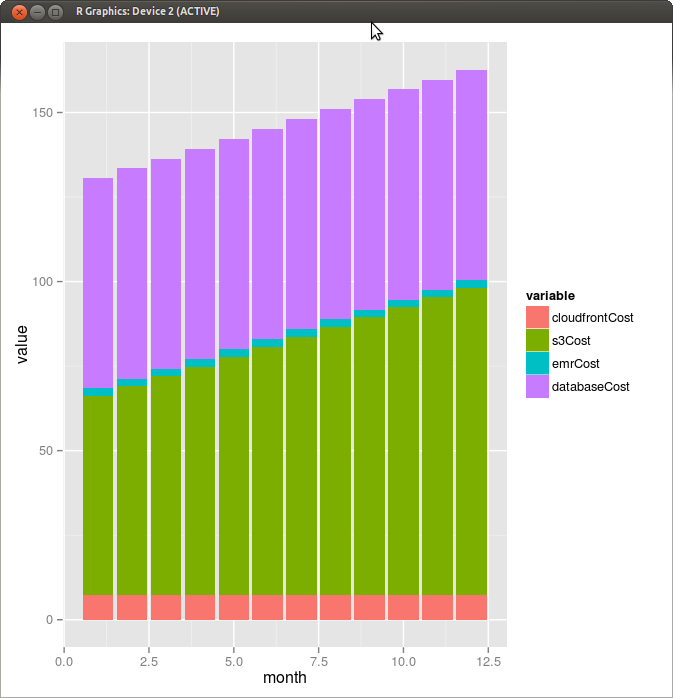

# The Snowplow TCO Model 

The Snowplow Total Cost of Ownership (TCO) Model, aka `snowplowtcomodel`, is an R package for estimating the **[Amazon Web Services] [aws]** fees associated with running Snowplow.

The model is a work in progress: 

1. We've made a number of simplifying asumptions (see the next section). Over time, we'll evolve the model to enable people to flex those assumptions
2. The model is very "raw" - you simply execute a function in R to forecast prices, and then use other R functionality (e.g. ggplot2) to plot the costs over time.

## Further reading

Please see the following blog posts for more on the Snowplow TCO Model:

* **[Unpicking the Snowplow data pipeline and how it drives AWS costs] [tco-blog1]**
* **[How much does Snowplow cost to run, vs the competition?] [tco-blog1]**
* _More blog posts coming soon_

## Assumptions

A number of simplifying assumptions have been made:

* All visitors tracked are located in the US. (Relevant when modelling Cloudfront costs.)
* All AWS services used are setup in the US-East-1 region. (The price of each AWS service varies by region.)
* The Cloudfront collector is used (rather than the Clojure Collector). These reduces EC2 and EBS costs, but increases S3 costs, because it generates a larger number of log files than the Clojure Collector.
* The Snowplow user tracks the same number of uniques and events each month

## Installing the package

You can install the package directly from Github, via `dev_tools`

	> library("devtools")
	> install_github("snowplow-tco-model", "snowplow")
	> library("snowplowtcomodel")

Alternatively, you may prefer to download the source code from Github, and load it locally:

	$ git clone git@github.com:snowplow/snowplow-tco-model.git
	$ cd snowplow-tco-model
	$ R
	> library("devtools")
	> load_all()

## Using the package

Using the package is straightforward, you simply call the `snowplowCostByMonth` function. 

The `snowplowCostByMonth` function takes the following arguments, all of which **must** be supplied:

| ** Argument ** | ** Description ** |
|:---------------|:------------------|
| uniquesPerMonth| The number of uniques tracked per month [type: integer] |
| eventsPerMonth | The number of events tracked per month [type: integer] |
| runsPerDay     | The number of times that the Enrichment process is run per day [type: integer] |
| storageDatabase| The database that is used to store Snowplow data. This can be 'redshift' or 'postgres' [type: integer] |
| numberOfMonths | The number of months that the model will run for |
| edgeLocations  | This is the number of locations on the Amazon Cloudfront network that generate a log file each time one of the associated nodes is hit. We are not sure how many of these exist in the Cloudfront network. (We guess there are 10k - 100k). This impacts S3 costs, because it determines how many log files are generated in each time period, and a certain number of requests are made per log file generated. |

For example, to find out how much Snowplow would cost for a user with 800k uniques per month, 5M events per month who uses PostgreSQL to store the data, we would run:

	> costModel <- snowplowCostByMonth(800000, 5000000, 1, 'postgres', 12, 10000)

We can view the data frame:

	> costModel
	   month cloudfrontCost   s3Cost emrCost databaseCost totalCost
	1      1       7.445363 58.70569    2.25     62.15856  130.5596
	2      2       7.445363 61.62843    2.25     62.15856  133.4823
	3      3       7.445363 64.55513    2.25     62.15856  136.4091
	4      4       7.445363 67.44618    2.25     62.15856  139.3001
	5      5       7.445363 70.37689    2.25     62.15856  142.2308
	6      6       7.445363 73.27102    2.25     62.15856  145.1249
	7      7       7.445363 76.18774    2.25     62.15856  148.0417
	8      8       7.445363 79.11249    2.25     62.15856  150.9664
	9      9       7.445363 82.02895    2.25     62.15856  153.8829
	10    10       7.445363 84.96548    2.25     62.15856  156.8194
	11    11       7.445363 87.85867    2.25     62.15856  159.7126
	12    12       7.445363 90.80062    2.25     62.15856  162.6545

We can now manipulate and visualize the data. For example, say we want to plot a stacked barchart of our different costs by month:
	
	> costs <- costModel[c(1:5)] # Create a data frame without the totalCost field

	> library("reshape")
	> costs <- melt(costs, id="month") # Melt the data

	> library("ggplot2") # Now we can plot our stacked bar
	> p <- ggplot(costs, aes(x=month, y=value, fill=variable))
	> p <- p + geom_bar(stat="identity")
	> p

The basic graph looks like this:

## Questions or need help?

Check out the **[Talk to us] [talk-to-us]** page on our wiki.

## Copyright and license

The Snowplow Total Cost of Ownership (TCO) Model is
copyright 2013 Snowplow Analytics Ltd.

Licensed under the **[Apache License, Version 2.0] [license]** (the "License");
you may not use this software except in compliance with the License.

Unless required by applicable law or agreed to in writing, software
distributed under the License is distributed on an "AS IS" BASIS,
WITHOUT WARRANTIES OR CONDITIONS OF ANY KIND, either express or implied.
See the License for the specific language governing permissions and
limitations under the License.

[aws]: http://aws.amazon.com/

[tco-blog1]: http://snowplowanalytics.com/blog/2013/07/09/understanding-how-different-parts-of-the-Snowplow-data-pipeline-drive-AWS-costs/
[tco-blog2]: http://snowplowanalytics.com/blog/2013/09/27/how-much-does-snowplow-cost-to-run/

[talk-to-us]: https://github.com/snowplow/snowplow/wiki/Talk-to-us
[license]: http://www.apache.org/licenses/LICENSE-2.0
